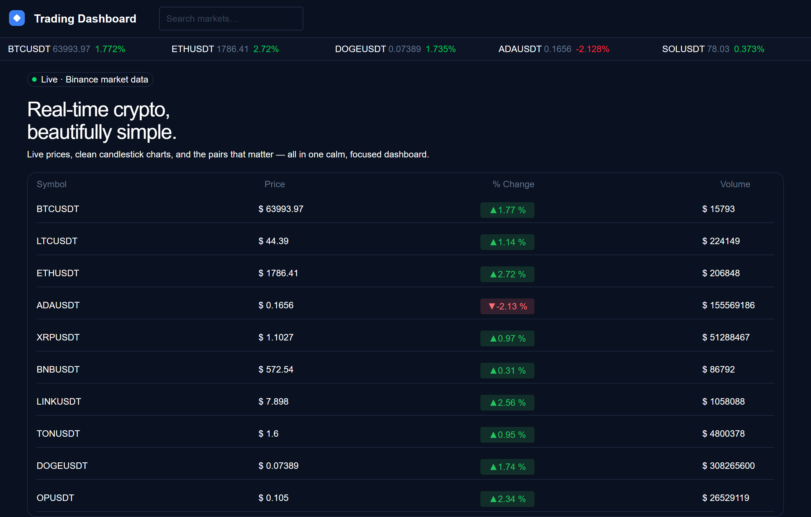
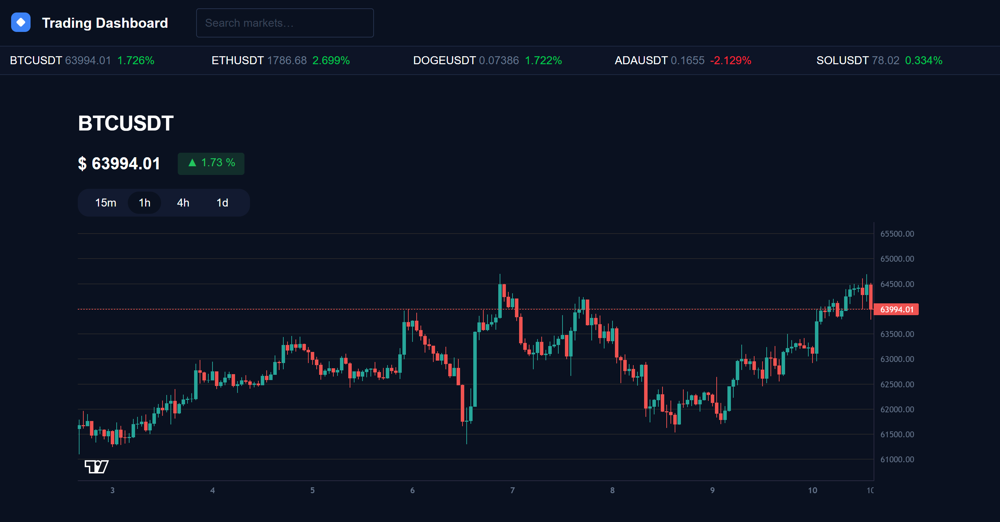

# Trading Dashboard

Real-time cryptocurrency dashboard with live price updates and candlestick charts. Built as a portfolio project to demonstrate WebSocket integration, real-time state management, and modern Next.js 15 architecture.

## Live Demo

[trading-dashboard.vercel.app](https://trading-dashboard-maxvol.vercel.app)

## Screenshots





## Features

- Live price updates for top USDT pairs via Binance WebSocket
- Detailed pair view with candlestick chart (TradingView Lightweight Charts)
- Multiple timeframes: 1h, 4h, 1d
- Real-time candle updates via kline WebSocket stream
- Search any USDT trading pair
- Auto-reconnect with exponential backoff on connection loss
- Dark theme optimized for extended use

## Tech Stack

- Next.js 15 (App Router)
- React 19 (Server Components)
- TypeScript
- Tailwind CSS 4
- Lightweight Charts by TradingView
- Binance REST API and WebSocket streams

## Architecture

**Stale-while-revalidate pattern:** REST batch request loads initial data instantly, then WebSocket streams provide real-time updates. This eliminates the multi-second loading flicker seen in naive WebSocket-only implementations where each connection is established sequentially.
Users see filled tables immediately instead of loading states.

**Custom hooks:**
- `useBinanceTicker` — subscribes to 24hr ticker stream for a symbol
- `useBinanceKline` — subscribes to kline stream for candle updates

**Discriminated union states:** connection states modeled as tagged unions (loading, success, reconnecting, error) for type-safe rendering.

**Reconnect strategy:** exponential backoff with MAX_ATTEMPTS limit. Distinguishes between intentional close, invalid symbol, and network loss.

## Local Development

```bash
git clone https://github.com/maxvol123/trading-dashboard.git
cd trading-dashboard
npm install
npm run dev
```

Open http://localhost:3000

## Project Structure

```
tradingDashboard/
├── public/
├── hooks/
│       │   ├── useBinanceTicker.ts # 24hr ticker WS stream + reconnect logic
│       │   └── useBinanceKline.ts  # kline (candle) WS stream + reconnect logic
├── src/
│   └── app/                        # Next.js App Router
│       ├── layout.tsx              # root layout: fonts, <Header>, global shell
│       ├── page.tsx                # home page — table of top USDT pairs
│       ├── globals.css             # Tailwind entry + global styles
│       ├── options.ts              # shared constants: INTERVALS, sizes, token list
│       ├── components/
│       │   ├── header.tsx          # top bar: logo, search, ticker strip
│       │   ├── searchBar.tsx       # symbol search with dropdown suggestions
│       │   ├── priceTicker.tsx     # single live ticker (used in header strip)
│       │   ├── marketElement.tsx   # one live row in the home table
│       │   └── pairChart.tsx       # candlestick chart + timeframe switcher
│       ├── lib/
│       │   ├── binance.ts          # REST calls: fetchCandles / fetchMultiplePairs / fetchSymbol
│       │   ├── types.ts            # Binance WS + UI type definitions
│       │   └── fetchBinanceTokenList.ts  # REST: list of all TRADING symbols (exchangeInfo)
│       └── pair/
│           └── [symbol]/
│               ├── page.tsx        # pair detail page (Server Component, initial candles)
│               └── component/
│                   └── heroTicker.tsx  # large live price header for the pair
├── eslint.config.mjs
├── next.config.ts
├── tsconfig.json
└── package.json
```

## Deployment

Deployed on Vercel: [link after deploy]

## What I Learned

- Real-time data architecture: combining REST batch fetches with WebSocket streams for instant initial render
- Discriminated unions for state modeling: replacing multiple boolean flags with tagged unions
- React hooks lifecycle: managing cleanup for multiple concurrent WebSocket connections, avoiding race conditions on interval switches
- Next.js App Router: Server Components for initial data fetching, Client Components for real-time state, dynamic routes with params
- WebSocket reconnect patterns: exponential backoff with MAX_ATTEMPTS, distinguishing intentional close from network loss
- Type-safe branded types (UTCTimestamp) for chart library integration

## Future Improvements

- Watchlist with Zustand state management + localStorage persist
- Portfolio simulation with virtual balance
- Trade journal with statistics
- Price alerts

## Author

Maksym Voloshyn - [LinkedIn](https://www.linkedin.com/in/maksym-voloshyn-8a937324b) - [GitHub](https://github.com/maxvol123)